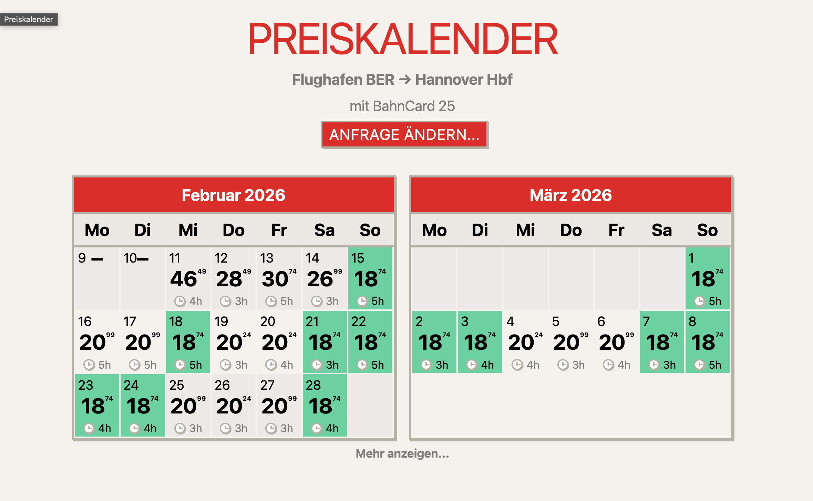

# bahn.guru (fork)

Fork of the original [bahn.guru](https://bahn.guru) with updated Deutsche Bahn API integration and refreshed frontend.

[](license)

<p align="center">
  
</p>

## What Changed

- Switched API integration to `db-vendo-client` profiles (`db`, `dbnav`, `dbweb`)
- Added dotenv-based runtime configuration (`.env`)
- Updated DB shop links to current `bahn.de` booking URLs
- Frontend redesign with neo-brutalist styling for light and dark mode
- Month-wise calendar UI with two month cards visible on wider screens
- Loading overlay for route and search transitions
- Day price links open DB booking page in a new tab

## Requirements

- Node.js `>=18` (Node 20 recommended)
- npm (or pnpm)

## Local Setup

1. Install dependencies:

```bash
npm install
```

2. Create `.env` from `.env.example` and adjust values:

```bash
cp .env.example .env
```

3. Build frontend bundle:

```bash
npm run build
```

4. Start development server:

```bash
npm run dev
```

5. Start production mode:

```bash
npm run start
```

Default app URL: `http://localhost:3000`

## Environment Variables

Configuration is loaded automatically via `dotenv` in `src/index.js`.

- `PORT` - HTTP port (default: `3000`)
- `DB_PROFILE` - API profile: `db`, `dbnav`, `dbweb` (default: `db`)
- `DB_USER_AGENT` - user agent passed to DB API client (default: `bahn.guru-v2`)
- `BESTPRICE` - enable best-price endpoint (`1`/`0`, default: `1`)
- `ALLOW_PRICELESS` - allow journeys without prices (`1`/`0`, default: `0`)
- `ANALYTICS` - enable Umami (`true`/`false`, default: `false`)
- `ANALYTICS_ID` - Umami site id when analytics is enabled

Example:

```dotenv
PORT=3000
DB_PROFILE=db
DB_USER_AGENT=bahn.guru-v2
BESTPRICE=1
ALLOW_PRICELESS=0
ANALYTICS=false
ANALYTICS_ID=
```

## Docker

The Docker setup uses a multi-stage build with Node 20 and pnpm 9.

Build image:

```bash
docker build -t bahn-guru:new .
```

Run container:

```bash
docker run --rm -p 3000:3000 --env-file .env bahn-guru:new
```

## Scripts

- `npm run build` - builds browser bundle to `assets/scripts/bundle/bahn.js`
- `npm run dev` - starts dev server with nodemon
- `npm run start` - starts production server
- `npm run lint` - lints `src`
- `npm run test` - lint + dependency check

## See Also

- [travel-price-map](https://github.com/juliuste/travel-price-map/)
- [db-vendo-client](https://github.com/public-transport/db-vendo-client/)
- [link.bahn.guru](https://github.com/juliuste/link.bahn.guru)

## Contributing

Issues and PRs are welcome.

## Support the Project ☕️

If you find Schugaa helpful, consider supporting its development!

<a href='https://ko-fi.com/abhishek0978' target='_blank'></a>
